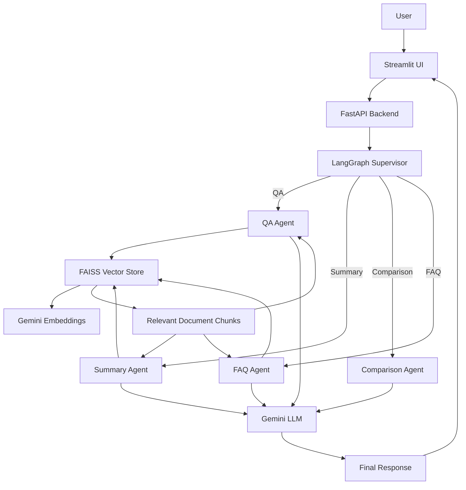

# Enterprise AI Document Intelligence Platform

An AI-powered document intelligence platform that allows users to upload PDF documents, ask questions, generate summaries, create FAQs, and compare two documents.

The application uses a multi-agent architecture with **LangGraph**, **FastAPI**, **Streamlit**, **FAISS**, and **Google Gemini**.

##  Features

- 📄 PDF document upload and processing
- 💬 RAG-based document Question Answering
- 📝 AI-powered document summarization
- 🔍 Comparison of two PDF documents
- ❓ Automatic FAQ generation
- 🤖 Multi-agent routing using LangGraph
- 🔎 FAISS-based vector similarity search
- 📚 Source-aware document retrieval

##  Architecture

